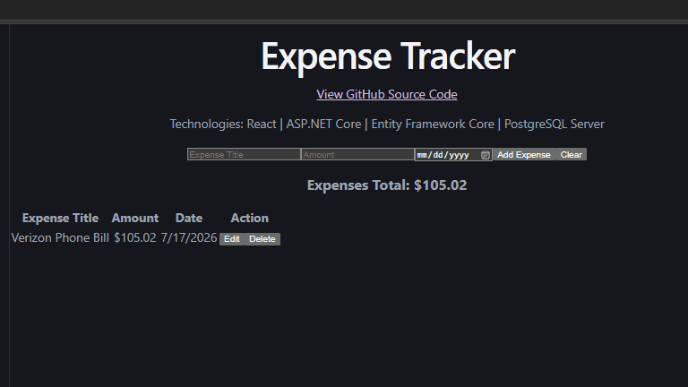

# Expense Tracker
A modern full-stack expense tracking application built with ASP.NET Core Web API, React, Entity Framework Core, and PostgreSQL. Users can create, edit, delete, and search expenses through a responsive web interface.

## Demo

The application demonstrates full CRUD functionality, allowing users to create, update, delete, and manage expenses through a React frontend backed by an ASP.NET Core Web API.




## Features
- Create expenses
- View expenses
- Update expenses
- Delete expenses
- RESTful ASP.NET Core Web API
- React frontend with JavaScript
- Entity Framework Core data access

  
## Planned Improvements
- User authentication
- Dashboard
- Receipt uploads
- Expense search
- Azure deployment
- Responsive mobile interface
- AI-assisted natural language search

## Architecture

```text
    ┌─────────────┐
    │ React + Vite│
    └──────┬──────┘
           │ HTTP
           ▼
┌──────────────────────┐
│ ASP.NET Core Web API │
└──────────┬───────────┘
           ▼
┌──────────────────────┐
│ Entity Framework Core│
└──────────┬───────────┘
           ▼
┌──────────────────────┐
│ PostgreSQL Database  │
└──────────────────────┘
```

## Tech Stack

### Frontend
- React
- JavaScript 
- Vite

### Backend
- ASP.NET Core Web API
- C#
- Entity Framework Core

### Database
- PostgreSQL 

### Cloud (planned)
- Azure App Service 
- Azure Database for PostgreSQL 

### DevOps (planned)
- Docker 
- GitHub Actions 

### Development Tools
- Git
- GitHub
- Visual Studio Code


## Getting Started

### Prerequisites

- .NET 10 SDK
- Node.js
- PostgreSQL

### Backend

```bash
cd ExpenseTracker.Api
dotnet restore
dotnet run
```

### Frontend

```bash
cd expense-tracker-client
npm install
npm run dev
```