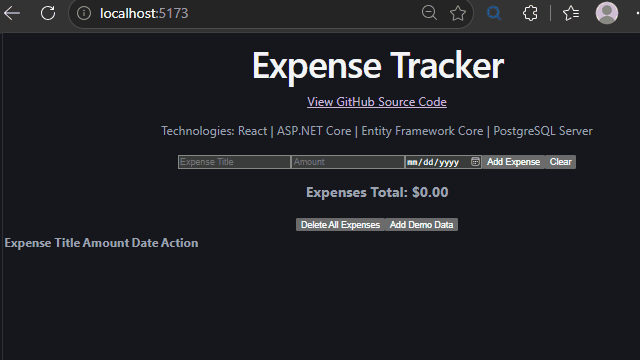

# Expense Tracker
A modern full-stack expense tracking application built with ASP.NET Core Web API, React, Entity Framework Core, and PostgreSQL. Users can create, edit, delete, and search expenses through a responsive web interface.




## Features
```text
- Create, view, update, and delete expenses
- Clear all expense records
- Automatically populate the database with realistic seed data
- RESTful ASP.NET Core Web API
- React frontend built with JavaScript
- Entity Framework Core data access
- PostgreSQL database
```
  
## Architecture

```text
Browser
   │
React UI
   │
expenseService.js using fetch()
   │
ASP.NET Core REST API endpoints
   │
ExpenseService service layer
   │
Entity Framework Core
   │
PostgreSQL
```

## Tech Stack

### Frontend
- React
- JavaScript 
- Vite

### Backend
- ASP.NET Core Web API
- C#
- Entity Framework Core

### Database
- PostgreSQL 

### Cloud (planned)
- Azure App Service 
- Azure Database for PostgreSQL 

### DevOps (planned)
- Docker 
- GitHub Actions 

### Development Tools
- Git
- GitHub
- Visual Studio Code


